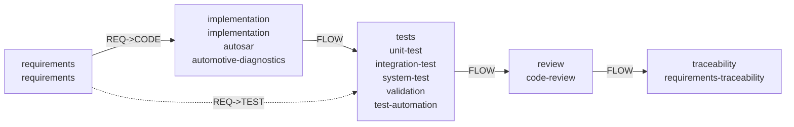

# Composition: automotive + AUTOSAR Classic diagnostics (UDS)

Worked example of the prompt-driven composer for the AUTOSAR-diagnostics top
skill: requirement analysis + code development + test-case generation + code
review + REQ->CODE / REQ->TEST mapping + code/script generation, interlinked
from one user prompt. Compositions derive — they never duplicate: the chain
below is the recorded output of `axiom compose`, recomputed live.

| Dimension | Choice | Canonical source |
|-----------|--------|------------------|
| Domain | automotive | `domains/automotive/` |
| Platform/OS | autosar-classic (MCU) | `skills/autosar/`, `skills/mcu/` |
| Top skill | automotive-diagnostics 1.3.0 | `skills/automotive-diagnostics/` (Rules 1–7) |
| Companion skills | requirements, implementation, unit-test, code-review, requirements-traceability, validation, test-automation | live `axiom engage` slice |
| Standards | ISO 14229-1, AUTOSAR DEXT | `axiom packs --standard` slice |
| Tools | diag-extract-bridge, diag-uds-testgen | `axiom packs` install plan |
| Agent | diag-auto-review (external CLI, gated) | `axiom packs` agents |

## Prompt

```bash
python -m axiom_cli compose "AUTOSAR Classic ECU: analyse diagnostic requirements, develop UDS server code, generate positive and negative test cases, review code, map requirements to code and tests" --domain automotive --platform autosar-classic --standard "ISO 14229-1"
```

## Mind-map (derived view)



## How to read it

1. **Requirement analysis** (`requirements` + automotive requirement-analyst
   overlay): service/DID/DTC/routine catalogue with session/security gates.
2. **Code development** (`implementation` + `autosar` + `automotive-diagnostics`
   Rules 1–4): UDS server, session layer, DID/DTC store, security hooks.
3. **Test-case generation** (`tests` stage + `diag-uds-testgen`): full
   SID/subfunction positive + negative matrix from the extract (Rules 5–6).
4. **Code review** (`code-review`, optionally `diag-auto-review` CLI): scope
   discipline + NRC/session-gate assertions.
5. **Mapping** (`requirements-traceability`): REQ->CODE
   (`requirements/SYS-xxx` → `src/<handler>`) and REQ->TEST
   (`requirements/SYS-xxx` → `test/<case>` → `uds_traceability.csv`).
6. **Code/script generation** (`diag-extract-bridge` + `diag-uds-testgen`):
   extract → canonical spec → vectors + provenance sidecar.

## Gate checklist

- [ ] Mind-map recomputed from the live prompt (`axiom compose`), not copied
- [ ] Every chain node resolves in the current engage/packs slices
- [ ] REQ->CODE and REQ->TEST chains gap-free with evidence ids
- [ ] Human approval recorded for safety/security deltas
